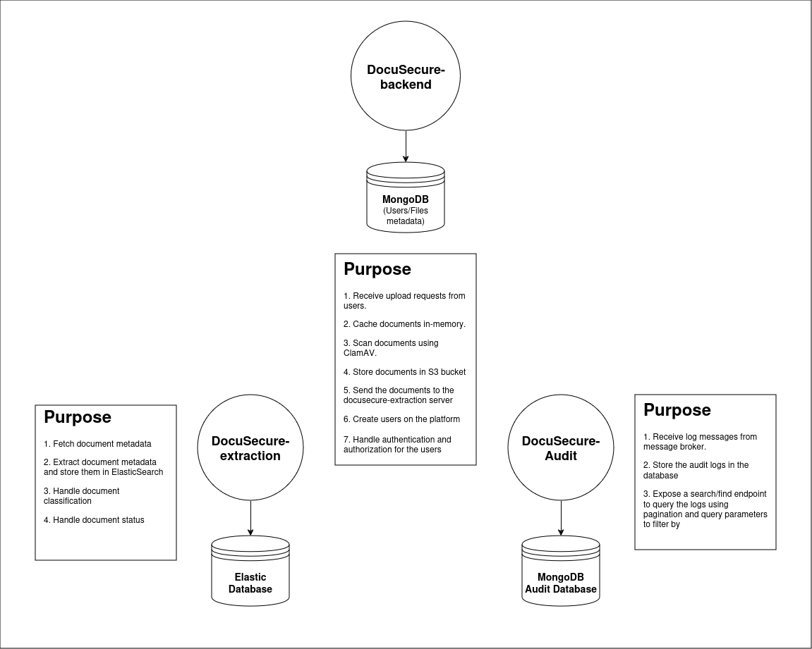
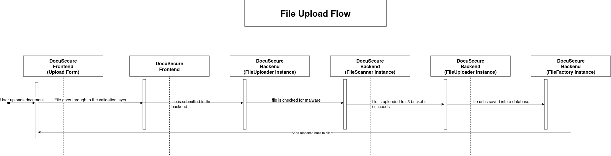
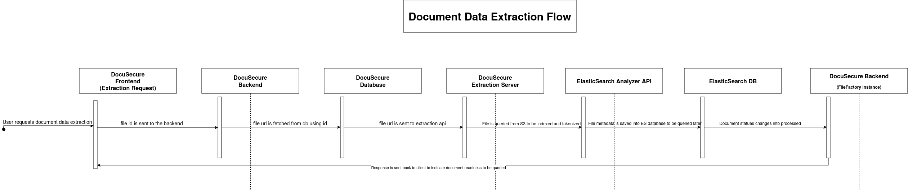
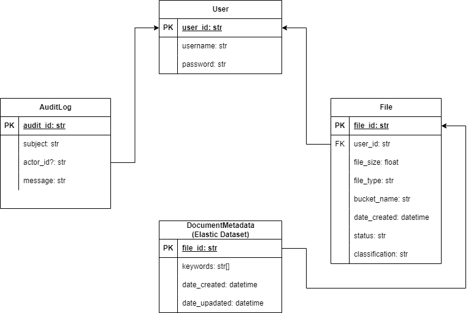

# DocuSecure Inc.
A **Document Processing System** for a fictional company, DocuSecure Inc., which handles sensitive documents. The system should securely process and store documents and provide a user interface for interacting with these documents. The requirements for the system will implicitly cover various aspects such as multithreading, user authentication, logging, and database interaction.

## Initial Design Documents:
### System Components
This is a basic non-formal illustration of the servers that comprise the backend for DocuSecure's document processing system to help visualize the main components.
 
 

 
 

### Document Processing Flow
The main purpose behind DocuSecure is document processing, so we naturally started by laying out simplified Data Flow diagrams for the two main phases of the processing.
1. **Document File Upload**
 
 

 
 

2. **Document Data Extraction**
 
 

 
 

### Database Entities
 
 

 
 
