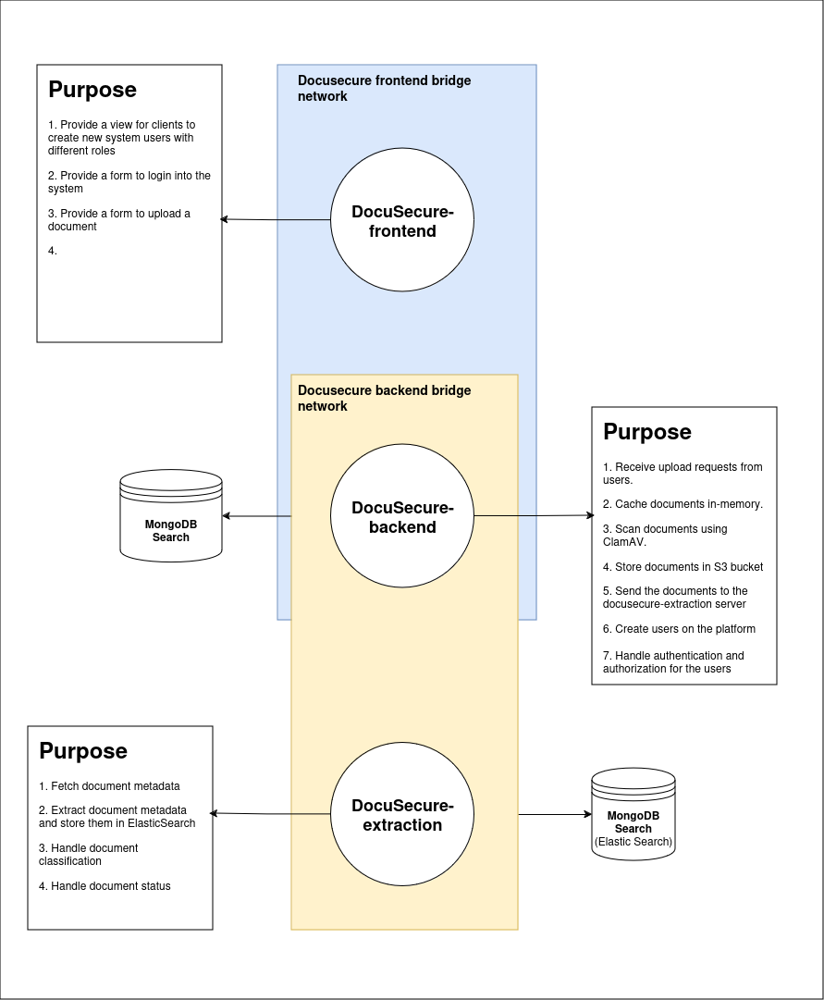
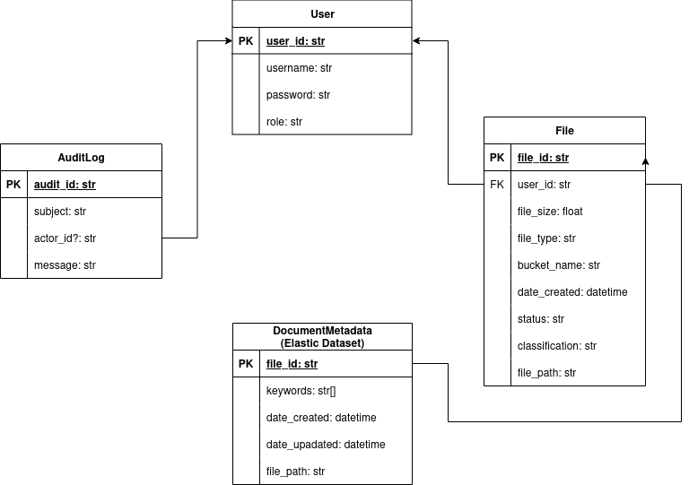

# DocuSecure Inc.
A **Document Processing System** for a fictional company, DocuSecure Inc., which handles sensitive documents. The system should securely process and store documents and provide a user interface for interacting with these documents. The requirements for the system will implicitly cover various aspects such as multithreading, user authentication, logging, and database interaction.

## Initial Design Documents:
### System Components
This is a basic non-formal illustration of the servers that comprise the backend for DocuSecure's document processing system to help visualize the main components.
<br>
<br>

<br>
<br>

### Document Processing Flow
The main purpose behind DocuSecure is document processing, so we naturally started by laying out simplified Data Flow diagrams for the two main phases of the processing.
1. **Document File Upload**
<br>
<br>

<br>
<br>

2. **Document Data Extraction**
<br>
<br>

<br>
<br>

### Database Entities
These are the four main database entities used. All of them are straight-forward, except for the documentmetadata entity. This is a table/collection made specifically for the keywords extracted and stored on ElasticSearch to make efficient full-text search available.
<br>
<br>

<br>
<br>


## How to start up:
It's straight forward to start up all the services with one command using `docker-compose`. You can cd into the entrypoint of the repo and run:
```shell
docker-compose up --watch
```