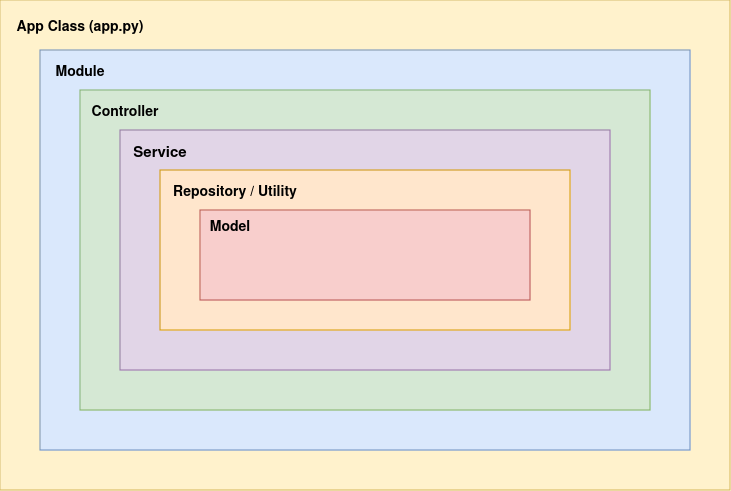

# DocuSecure Main Backend
This server is the main point of communication for any DocuSecure client.
it shares the networks with both the **Docusecure-frontend** service, and the **Docusecure-external-api** service.

## 1. System Structure
* ***Module***:
The system is modulerized, where each system entity has it's wrapping module. Each module encapsulates all functionality related to it, along with its dependencies.

* ***App Class***: The main class and the entry point for the entire backend.

* ***Controller***: The system relies heavily on dependency injection. Due to the time constraint, there was no time to create an IOC container to declaratively inject all dependencies on startup, so DI was done manually at each entry point of a module.

* ***Service***: Each module has the controller as it's first and main dependency, which is how the module is exposed to the public as a bunch of REST endpoints.

* ***Repository***: Controllers' only responsibility is to function as route handlers, the rest of the business logic is delegated to the Service classes. Service classes do all the business work required, then delegate the database interaction to a wrapping repository (data access layer) to separate the databade ODM/ORM from the actual business logic to prevent tight coupling between service classes and the underlying database driver/orm.

* ***Model***: Last thing is the database model, the class we interact with to send database queries.
 
 

 
 

## 2. Multithreading Utilization
Multithreading is introduced implicitly mainly  through the FastApi framework's interface. The multithreading module of the framework is utilized for two different workloads, but mainly in our system so far only one of them is used.

The two types of workloads handled are:

1. **CPU-bound tasks**:
For cpu-bound workloads, FastApi offers the regular `def` method definitions, where for each request, a thread in the threadpool is created and dedicated to that request. Any blocking operation within that request would block that specific thread, but it won't block the main event loop thread that receives new connections.

2. **I/O-bound tasks**: For i/o-bound workload (most of our system's workload), FastApi offers the `async def` methods. In `async def` defined methods, each request is handled by the main event loop's thread, but whenever an await expression is used before an i/o task, that task is suspended and delegated to another thread that would work on it, and then notify the main event loop's thread when it finishes.

## 3. Logging
Due to the time constraints, an efficient logging mechanism hasn't been put in action.

**The goal** was to have a global logging middleware mounted to log all requests with their method, timestamp, status_code, user_name, response and role. Then save this log as a text that would later be indexed and analyzed by a database that allows full-text search, such as ***ElasticSearch***. Then have a global exception handler that would intercept any exception, log it, then store it in the database.
